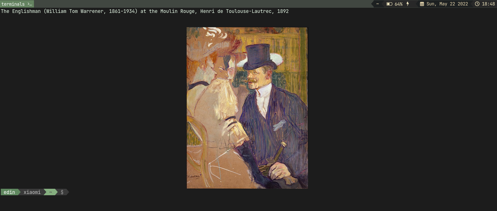

# TerminalMuseum

Add a unique museum-like experience to your terminal!

TerminalMuseum is a CLI tool that displays a random piece of classical art onto your terminal.


## Installation

Use the package manager [pip](https://pip.pypa.io/en/stable/) to install TerminalMuseum.

```bash
pip install terminalmuseum
```

## Usage
The command to display images varies between terminal emulators, and many can not display images at all.

Add the following line to ur `.bashrc` depending on ur terminal emulator:

#### Kitty 

```bash
terminalmuseum --command "kitty +kitten icat" --print_title
```

## Art
The Art used in this project is in the public domain and was sorted and downloaded via the [openaccess](https://github.com/metmuseum/openaccess) project of the Metropolitan Museum of Art.

## Contributing
Pull requests are welcome. For major changes, please open an issue first to discuss what you would like to change.

Please make sure to update tests or add them as appropriate.


## License
[Apache 2.0](http://www.apache.org/licenses/LICENSE-2.0)
